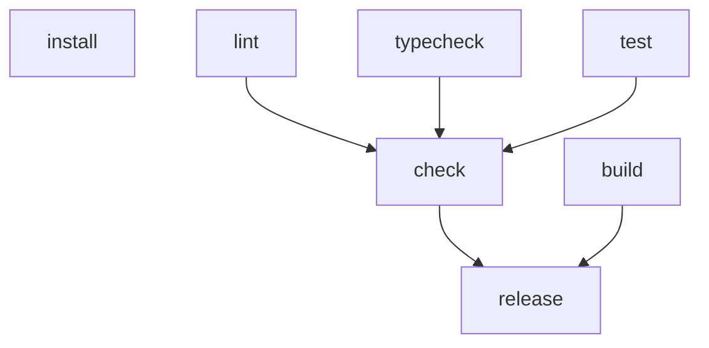

# ntask

[](https://pypi.org/project/ntask/)
[](https://pypi.org/project/ntask/)
[](https://pypi.org/project/ntask/)
[](https://github.com/sn/ntask/actions?query=branch%3Amain)

A Python-native task runner with content-hash caching and DAG execution.

```bash
pip install ntask
```

## Why

Your Makefile runs everything every time. Your Justfile has no dependency graph. Your `tasks.py` for Invoke is five years old, has no types, and you still have to write `ctx.run`. This is what a task runner looks like when you start over with caching, types, and a DAG.

## Quickstart

A complete release pipeline in 20 lines. Drop this into `tasks.py` at your project root:

```python
from ntask import task, cached, shell

@task
@cached(inputs=["src/**/*.py"])
def lint():
    shell("ruff check src/")

@task
@cached(inputs=["src/**/*.py"])
def typecheck():
    shell("mypy src/")

@task
@cached(inputs=["src/**/*.py", "tests/**/*.py"])
def test(pattern: str = ""):
    shell(f"pytest -q {'-k ' + pattern if pattern else ''}")

@task
@cached(inputs=["src/**/*.py", "pyproject.toml"], outputs=["dist/"])
def build():
    shell("python -m build")

@task(deps=[lint, typecheck, test, build])
def release(version: str):
    """Run checks, build, tag, and publish to PyPI."""
    shell(f"git tag v{version} && git push --tags && twine upload dist/*")
```

The first time you cut a release, every step runs:

```
$ ntask release --version=1.0.0 -j
running lint
running typecheck
running test
+ lint       (1.4s)
+ typecheck  (3.2s)
+ test       (4.9s)
running build
+ build      (2.3s)
running release
+ release    (0.9s)
```

The second time, ntask hashes the inputs, sees nothing changed, and skips every cached task. The whole `dist/` directory is restored from the content-addressed store without re-running `build`:

```
$ ntask release --version=1.0.1 -j
o lint       cached (3a8f9c2d)
o typecheck  cached (b7c5f1e9)
o test       cached (9f2e8b14)
o build      cached (4dab8273)   <- dist/ restored, build did not run
running release
+ release    (0.9s)
```

Edit one file in `src/` and only the tasks whose inputs match that file rerun. `release` isn't cached so it always runs, but everything downstream of an unchanged input stays a hit. That's transitive content-hash caching in five decorators.

Other things you'll reach for:

```bash
ntask --list                       # show every registered task with docstring
ntask test --pattern=auth          # type hints become CLI flags automatically
ntask --why test                   # explain the last cache decision item-by-item
ntask --graph release              # ASCII DAG (mermaid / dot also available)
ntask watch test                   # rerun on every src/ or tests/ change
```

### Mermaid graph for docs

`--graph-format mermaid` emits a Mermaid block you can paste directly
into a README or design doc. The example below is `ntask`'s own DAG,
captured straight from `ntask --graph --graph-format mermaid`:



`--graph-format dot` produces Graphviz output for the same data.

## Team cache

Share cache hits across machines via S3 (or GCS, HTTP, NFS):

```toml
# pyproject.toml
[tool.ntask.remote_cache]
type = "s3"
bucket = "my-team-cache"
```

```bash
pip install ntask[s3]
ntask check                        # first person populates, the rest hit instantly
ntask check --offline              # skip the remote for fast dev loops
```

S3-compatibles (MinIO, R2, B2) take an `endpoint_url`. GCS and HTTP backends work the same way; the HTTP backend is plain `GET`/`PUT`/`HEAD` over stdlib `urllib`, so any object store with PUT enabled is fair game.

## When NOT to use `@cached`

`@cached` shines on deterministic, input-driven work — `lint`, `typecheck`,
`test`, `build`. It's the wrong fit when the task is *the world reacting*.
Skip it (or be very deliberate about `inputs=` and `env=`) when the task:

- has external side effects — DB writes, HTTP requests, sending email, queue
  pushes. A cache hit means none of that happened on this run.
- mutates shared state your other tasks read — caches, file ownership, the
  contents of `.env`, dotted-out feature flags, the kernel's TCP backlog.
- depends on the clock or on randomness — anything where the same inputs
  produce different output tomorrow.
- *exists to test the world* — smoke tasks, integration probes, "does prod
  still look healthy" scenarios. The whole point is to re-execute.

For these, plain `@task` is the right call. Reach for `parallel=False` if
the task must run alone (releases, migrations); reach for `@group(...)` to
namespace them; don't reach for `@cached`.

## Live DAG display

Run `ntask check` from an interactive terminal and a Textual TUI shows a live tree of the DAG with per-task state icons and durations. Pipe the output, set `tui = false` in `[tool.ntask]`, or pass `--no-tui` to fall back to the line-based renderer.

## Other things you'll reach for

- **Exclusive tasks.** `@task(parallel=False)` makes a task a DAG-wide barrier: it waits for everything in flight to drain, then runs alone. Use it for releases, migrations, anything that mutates shared state.
- **Monorepos.** `@group("api")` over a class namespaces every task method as `api.<name>`. Cross-group dependencies via `@task(deps=[Other.task, ...])` or string fqns.
- **Capture output.** `shell("git rev-parse HEAD", capture=True)` returns a `ShellResult` with `.stdout`, `.stderr`, `.returncode`, `.duration`, `.ok`.
- **Force a rerun.** `ntask --force <task>` bypasses the cache for that one task. `ntask --no-cache` ignores the cache entirely. `ntask clean` wipes entry manifests; `ntask clean --all` wipes the whole `.ntask/` directory.

## Examples

Six runnable, self-contained examples under [`examples/`](examples/):

| File                                            | Demonstrates                                   |
|----------------------------------------------|------------------------------------------------|
| [01-hello](examples/01-hello/)               | Smallest possible cached task                  |
| [02-python-lib](examples/02-python-lib/)     | install / lint / typecheck / test / build      |
| [03-parallel](examples/03-parallel/)         | `-j N` fan-out and `parallel=False` barrier    |
| [04-watch](examples/04-watch/)               | `ntask watch` rerun-on-change loop             |
| [05-remote-cache](examples/05-remote-cache/) | local-fs remote backend shared between clones  |
| [06-monorepo](examples/06-monorepo/)         | `@group(...)` namespacing and cross-group deps |

`cd` into any directory and run `ntask --list`.

## Features

| feature                          | ntask |  make   |  just   | invoke  |  doit   |   poe   |
|----------------------------------|:-----:|:-------:|:-------:|:-------:|:-------:|:-------:|
| Typed Python tasks               |  yes  |   no    |   no    | partial |   no    | partial |
| Content-hash input caching       |  yes  | partial |   no    |   no    | partial |   no    |
| Transitive cache-key propagation |  yes  |   no    |   no    |   no    | partial |   no    |
| Remote cache (S3/GCS/HTTP)       |  yes  |   no    |   no    |   no    |   no    |   no    |
| DAG dependency resolution        |  yes  |   yes   |   no    | partial |   yes   |   no    |
| Type-hint to CLI args            |  yes  |   no    | partial | partial |   no    |   yes   |
| Parallel DAG execution (`-j`)    |  yes  |   yes   |   no    |   no    |   yes   |   no    |
| Live DAG TUI                     |  yes  |   no    |   no    |   no    |   no    |   no    |
| Windows first-class              |  yes  | partial |   yes   |   yes   |   yes   |   yes   |

Cache miss messages name the specific file or env change that caused the invalidation. `ntask --why <task>` prints the full breakdown.

## Docs

- [Technical handbook](docs/guide.md) - the comprehensive reference, every flag and config key
- [Tutorial: replace your Makefile in 10 minutes](docs/tutorial.md)
- [Caching: the full contract](docs/caching.md)
- [Migrating from Make / just / Invoke / Poe](docs/migration.md)
- [Short API reference](docs/reference.md)

Requirements: Python 3.11 or newer. BSD-3-Clause.

## License

BSD-3-Clause. Copyright © 2026 Sean Nieuwoudt.
